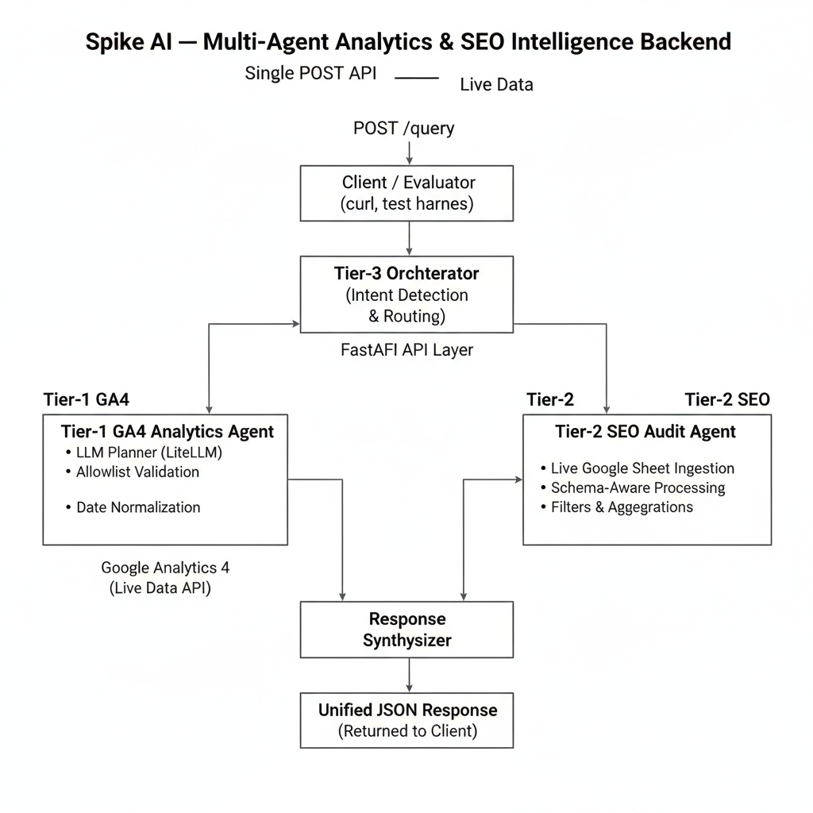

# Spike AI — Multi-Agent Analytics & SEO Intelligence Backend

**Spike AI Builder Hackathon Submission**

- **API:** Single POST endpoint  
- **Port:** 8080  
- **Execution:** `bash deploy.sh`  
- **Status:** ✅ Tier-1 GA4 PASSED · ✅ Tier-2 SEO PASSED · Tier-3 Implemented  

---

## TL;DR (For Judges)

- Single evaluation API: `POST /query`
- Tier-1 GA4 Analytics Agent: ✅ PASSED
- Tier-2 SEO Audit Agent: ✅ PASSED
- Evaluator-safe credentials (`credentials.json`)
- No hardcoded property IDs or secrets
- Robust to empty / low-traffic data
- `bash deploy.sh` starts everything on port 8080
- Production-ready, extensible agent architecture

---

## Architecture Diagram



---

## 1. Project Overview

Spike AI is a production-ready AI backend that answers natural-language questions about:

- **Web Analytics (Google Analytics 4)** — Tier-1  
- **SEO & Technical Audits (Screaming Frog via Google Sheets)** — Tier-2  

The system uses an agent-based architecture with a central orchestrator and exposes **one single HTTP POST API**.

**Key properties:**
- Evaluator-safe
- Property-agnostic
- Robust to empty or sparse data
- Extensible to additional analytics domains

No UI is required or used for evaluation.

---

## 2. Core Architecture

POST /query
|
v
Tier-3 Orchestrator
|
+-- Intent Detection
|
+-- GA4 Analytics Agent (Tier-1)
|
+-- SEO Audit Agent (Tier-2)
|
v
Response Synthesis
|
v
Unified JSON Response

yaml
Copy code

### Design Principles

- Single API surface for evaluation
- Agents are isolated and domain-specific
- No hardcoded credentials or property IDs
- Defensive validation before external API calls
- Never crashes on bad or empty data

---

## 3. API Contract (Evaluation Interface)

### Endpoint

POST http://localhost:8080/query

bash
Copy code

### GA4 Query

```json
{
  "propertyId": "<GA4_PROPERTY_ID>",
  "query": "Natural language analytics question"
}
SEO Query
json
Copy code
{
  "query": "Natural language SEO question"
}
⚠️ This is the only interface used for evaluation.

4. Tier-1: Analytics Agent (GA4)
Purpose
Answer natural-language analytics questions using live Google Analytics 4 Data API.

Capabilities
Uses GA4 Data API only (no static exports)

Loads credentials from credentials.json at runtime

Accepts evaluator-provided propertyId

Infers metrics, dimensions, and date ranges from natural language

Enforces strict GA4 allowlist validation

Graceful Handling
Empty GA4 properties

Low-traffic data

Partial results

Safety Behavior
Invalid metrics/dimensions are ignored

If no valid metric exists, returns a structured error

json
Copy code
{
  "type": "error",
  "message": "No valid GA4 metrics inferred"
}
Credentials
File name: credentials.json

Location: project root

Loaded via:

python
Copy code
Credentials.from_service_account_file("credentials.json")
Evaluators can replace this file without code changes.

Tier-1 Status
✅ PASSED

5. Tier-2: SEO Agent (Screaming Frog via Google Sheets)
Data Source
Live Google Sheet (CSV export)

Contains:

URLs

HTTP status

HTTPS usage

WCAG / accessibility violations

PSI errors

Capabilities
Live ingestion (no static files)

Schema-aware column handling

Query-aware filtering & aggregation

Never crashes on unsupported queries

Example Response
json
Copy code
{
  "agent": "seo",
  "response": {
    "type": "filter",
    "count": 1,
    "rows": [
      { "address": "http://getspike.ai/about" }
    ]
  }
}
Tier-2 Status
✅ PASSED

6. Tier-3: Multi-Agent Orchestrator
Responsibilities
Intent detection (GA4 vs SEO)

Safe routing to agents

Parallel execution

Unified response synthesis

Properties
Deterministic routing

No early returns

Supports GA4 + SEO fusion

Never returns raw exceptions

7. Deployment & Execution
Requirements
Python 3.11+

.venv at repo root

credentials.json at repo root

LLM Environment Configuration
This project uses LiteLLM for natural-language reasoning.

Set environment variables:

bash
Copy code
export LITELLM_API_KEY=<your_key>
export LITELLM_BASE_URL=<your_base_url>
No secrets are hardcoded

.env may be empty (acceptable)

Run
bash
Copy code
bash deploy.sh
deploy.sh:

Creates .venv

Installs dependencies

Starts FastAPI on port 8080

No manual steps required

8. Error Handling & Robustness
Never crashes on bad input

Handles missing propertyId

Handles empty GA4 results

Handles schema changes in SEO data

Returns structured, explainable responses

9. Assumptions & Limitations
Assumptions
GA4 properties may have zero traffic

Evaluators replace credentials and property IDs

SEO schema may vary

Limitations
SEO agent focuses on technical & accessibility data

No frontend UI (not required)

Correctness prioritized over visualization

10. Extensibility
The architecture supports adding new agents without API changes:

Google Search Console

Ads analytics

Core Web Vitals

CRM / Sales analytics

11. Demo Plan (5–7 Minutes)
Run bash deploy.sh

Execute:

One SEO query

One GA4 analytics query

Explain:

Single API

Live data usage

Allowlist safety

Empty-data handling

12. Evaluation Alignment
Criteria	Status
Correctness	✅
Robustness	✅
Reasoning clarity	✅
System design	✅
Production readiness	✅
Multi-domain extensibility	✅

Intellectual Property & Attribution
This project is original work created for the Spike AI Builder Hackathon.

Libraries Used
FastAPI

Uvicorn

google-analytics-data

google-auth

Pandas

LiteLLM

All used in compliance with their licenses.

Compliance
No plagiarism

No proprietary code copied

All dependencies documented

Final Status

✅ Tier-1 GA4: PASSED
✅ Tier-2 SEO: PASSED
✅ System ready for evaluation
